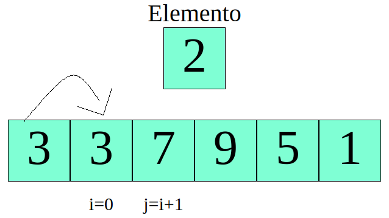
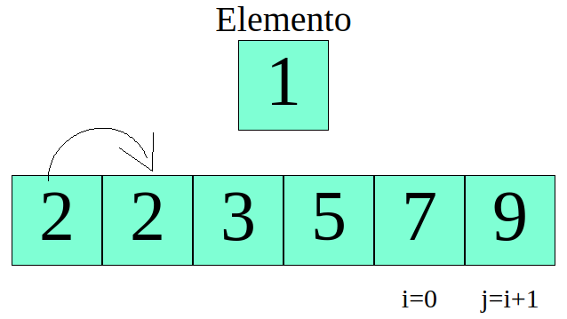

// A função insertionSort recebe um array de 0 até n elementos
```
insertionSort($A[0...n]) 

    Loop_1 de $i <- 0 até n
        $j <- $i+1;
        $elemento <- $A[j];
        

        Loop_2 enquanto $j > 0 E $elemento < $A[j-1]
            $A[j] = $A[j-1];
            $j <- $j-1;
        fim do Loop_2

        $A[j] <- $elemento;
    
    fim do Loop_1

fim do insertionSort
```

A organização do algoritimo de inserção (insertion sort) funciona como quando nós organizamos um jogo de cartas em nossa mão, procuramos o lugar da primeira carta, depois da segunda, e assim sucessivamente até a última.

pegamos como exemplo o seguinte array:


Inicialmente $i <- 0, logo estamos no primeiro elemento do array, em seguida atribuimos a $j <- $i + 1 ($j <- 1), guardamos esse elemento na variavel **$elemento** e verificamos se ela é menor que o elemento anterior, no caso 7 nao é menor que 3 então o algoritimo devolve o 7 para o lugar dele.


Em seguida, o Loop_1 incrementa $i, agora $i <- 1 e $j <- 2, colocamos o elemento dois do array na variável **$elemento** e verificamos se ela é menor que o elemento anterior, neste caso 2 é menor que 7


Então passamos 7 para o lugar do dois, o $j é decrementado e passa a valer $j <- $j-1 ($j <- 1), o elemento anterior é 0 logo verificamos se 2 (**$elemento**) é menor que 3 ($A[0]).


Como é verdade então passamos o 3 para o lugar do 7. 



nesse momento $j é decrementado novamente e passa a valer 0 $j <- 0, logo ele sai do Loop_2 e atribui o valor do elemento para $A[0] <- $elemento.


esses passos sao seguidos até que o vetor (array esteja completamente organizado)




